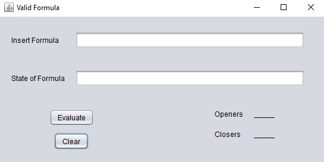
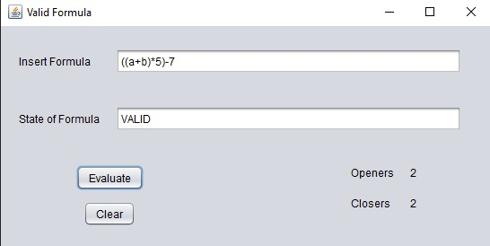
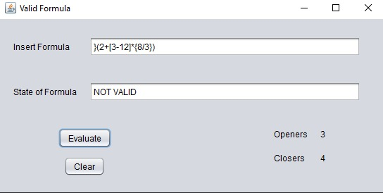
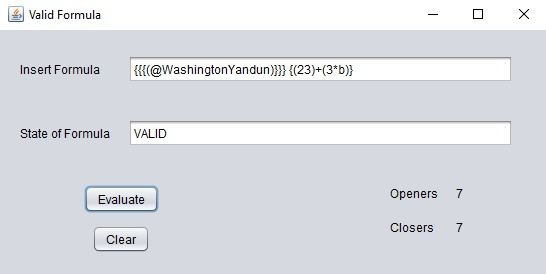

# ValidFormula.java
Homework about stacks.

## Quick description.
- Made in Netbeans
- Java - (Use of Stacks)
- GUI
- Tiny projects

## Samples

##### Initial view and Clear

##### Evaluation 1

##### Evaluation 2

##### Evaluation 3

#### Done By:
- [@WashingtonYandun](https://github.com/WashingtonYandun)
